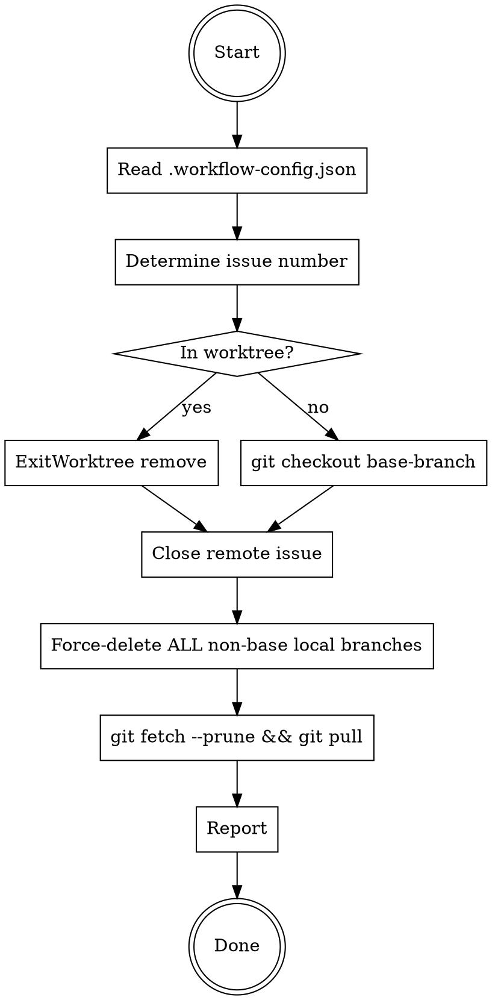

# Issue Close

## Overview

Close a GitHub/GitLab issue and clean up the local environment: exit worktree (if any), close the remote issue, **force-delete ALL non-base local branches**, prune stale remote refs, and pull latest.

**All behavior is driven by `.workflow-config.json` in the repo root.** Read it first.

## Process Flow



## Step-by-Step

### 1. Read Config

Read `.workflow-config.json` from repo root. Extract `type`, `base-branch`, and `need-worktree`.

### 2. Determine Issue Number

Extract issue number from the **current branch name** using `branch-template` pattern. For template `feature/{issue-no}-{issue-subject}` and branch `feature/15-user-login`, issue number = `15`.

If extraction fails or user explicitly provides an issue number, use the user-provided number.

### 3. Return to Base Branch

**If in a worktree** (created via `EnterWorktree`):
- Use `ExitWorktree` tool with `action: "remove"`.
- If worktree has uncommitted changes, `ExitWorktree` will refuse. In that case, ask the user whether to discard changes (`discard_changes: true`) or abort.

**If NOT in a worktree:**
```bash
git checkout <base-branch>
```

### 4. Close Remote Issue

Based on `type` in config:

- **GitHub:** `gh issue close <issue-no>`
- **GitLab:** `glab issue close <issue-no>`

If the issue is already closed, this is a no-op — proceed without error.

### 5. Force-Delete ALL Non-Base Local Branches

**CRITICAL: Delete ALL local branches except `base-branch`. Not just the current feature branch. Not just merged branches. ALL of them.**

```bash
git branch | grep -v '^\* ' | grep -v '^  <base-branch>$' | xargs git branch -D
```

Use exact match for `base-branch` to avoid false positives (e.g. `grep -v 'main'` would wrongly skip a branch named `feature/maintain-db`). The `^\* ` filter skips the current branch marker.

This uses `-D` (force delete), not `-d`. Unmerged branches are deleted too. This is intentional — the user wants a clean slate.

**Do NOT:**
- Delete only the current feature branch
- Use `-d` (safe delete) instead of `-D`
- Skip branches because they "might be needed"
- Ask the user for confirmation on each branch

### 6. Prune and Pull

```bash
git fetch --prune
git pull
```

`git fetch --prune` removes local remote-tracking refs for branches deleted on the remote. `git pull` brings the base branch up to date.

### 7. Report

Tell the user:
- Which issue was closed (number + link)
- How many local branches were deleted (list them)
- Confirmation that base branch is up to date

## Common Mistakes

| Mistake | Correct Behavior |
|---------|-----------------|
| Only delete current feature branch | Delete **ALL** non-base local branches |
| Use `git branch -d` (safe delete) | Use `git branch -D` (force delete) |
| Delete remote feature branch | Do **NOT** delete remote branches |
| Skip reading `.workflow-config.json` | Always read config first |
| Ask for confirmation before deleting branches | Just delete them — user invoked `/issue-close` intentionally |
| Forget `git fetch --prune` | Always prune stale remote-tracking refs |
| Run `git pull` before switching to base branch | Switch to base branch FIRST, then pull |
