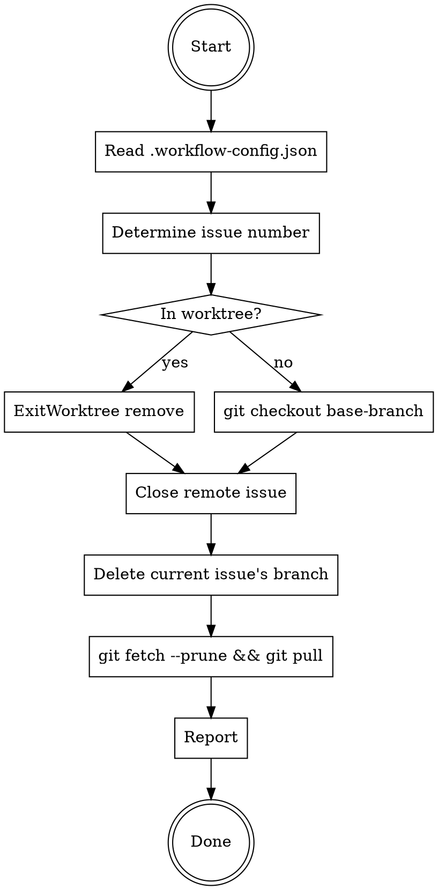

# Issue Close

## Overview

Close a GitHub/GitLab issue and clean up the local environment: exit worktree (if any), close the remote issue, **delete the current issue's local branch**, prune stale remote refs, and pull latest.

**All behavior is driven by `.workflow-config.json` in the repo root.** Read it first.

## Process Flow



## Step-by-Step

### 1. Read Config

Read `.workflow-config.json` from repo root. Extract `type`, `base-branch`, and `need-worktree`.

### 2. Determine Issue Number

Extract issue number from the **current branch name** using `branch-template` pattern. For template `feature/{issue-no}-{issue-subject}` and branch `feature/15-user-login`, issue number = `15`.

If extraction fails or user explicitly provides an issue number, use the user-provided number.

### 3. Return to Base Branch

**If in a worktree** (created via `EnterWorktree`):
- Use `ExitWorktree` tool with `action: "remove"`.
- If worktree has uncommitted changes, `ExitWorktree` will refuse. In that case, ask the user whether to discard changes (`discard_changes: true`) or abort.

**If NOT in a worktree:**
```bash
git checkout <base-branch>
```

### 4. Close Remote Issue

Based on `type` in config:

- **GitHub:** `gh issue close <issue-no>`
- **GitLab:** `glab issue close <issue-no>`

If the issue is already closed, this is a no-op — proceed without error.

### 5. Delete Current Issue's Branch

**Only delete the branch associated with the current issue.** Do NOT delete other branches.

The branch name was determined in Step 2 (e.g. `feature/67-add-bypass-permissions-mode`). Delete it:

```bash
git branch -D <branch-name>
```

Also delete any worktree-prefixed branch that was created for this issue (e.g. `worktree-feature+67-add-bypass-permissions-mode`):

```bash
git branch -D worktree-<branch-name-with-slashes-replaced-by-plus> 2>/dev/null
```

**Do NOT:**
- Delete ALL non-base local branches — other branches belong to other issues
- Delete branches used by other worktrees
- Delete remote branches

### 6. Prune and Pull

```bash
git fetch --prune
git pull
```

`git fetch --prune` removes local remote-tracking refs for branches deleted on the remote. `git pull` brings the base branch up to date.

### 7. Report

Tell the user:
- Which issue was closed (number + link)
- How many local branches were deleted (list them)
- Confirmation that base branch is up to date

## Common Mistakes

| Mistake | Correct Behavior |
|---------|-----------------|
| Delete ALL non-base local branches | Only delete the **current issue's** branch (and its worktree branch) |
| Delete branches used by other worktrees | Skip branches occupied by other worktrees |
| Delete remote feature branch | Do **NOT** delete remote branches |
| Skip reading `.workflow-config.json` | Always read config first |
| Ask for confirmation before deleting branch | Just delete it — user invoked `/issue-close` intentionally |
| Forget `git fetch --prune` | Always prune stale remote-tracking refs |
| Run `git pull` before switching to base branch | Switch to base branch FIRST, then pull |
