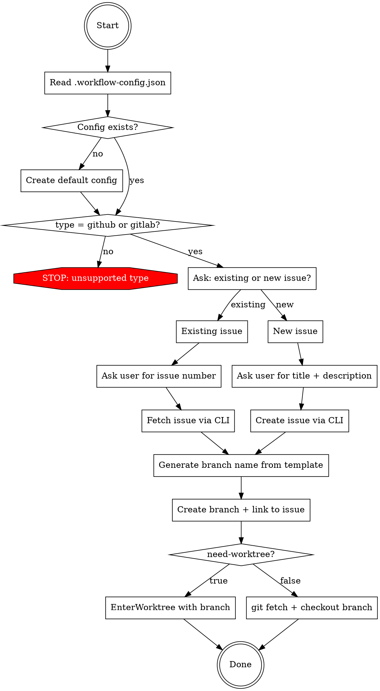

# Issue Init

## Overview

Initialize a development workflow: create or link an issue on GitHub/GitLab, create a branch from the configured base, and set up the working environment (worktree or checkout).

**All behavior is driven by `.workflow-config.json` in the repo root.** Read it first, create it with defaults if missing.

## Process Flow



## .workflow-config.json

Located at **repo root**. If missing, create with these defaults and show the user:

```json
{
  "type": "github",
  "base-branch": "main",
  "branch-template": "feature/{issue-no}-{issue-subject}",
  "need-worktree": true,
  "remarks": ""
}
```

| Field | Description |
|-------|-------------|
| `type` | `"github"` or `"gitlab"`. Determines CLI tool (`gh` vs `glab`). |
| `base-branch` | Branch to create feature branch from. |
| `branch-template` | Template for branch names. `{issue-no}` and `{issue-subject}` are replaced. |
| `need-worktree` | Whether to use `EnterWorktree` tool or plain `git checkout`. |
| `remarks` | Extra instructions loaded as context when `/issue-init` runs. Can be any text — e.g. issue labeling rules, naming conventions, team workflow notes. Empty string means no extra context. |

## Step-by-Step

### 1. Read Config

Read `.workflow-config.json` from repo root. If not found, create with defaults above, inform user, and continue.

**If `remarks` is non-empty, treat it as additional instructions for this entire workflow.** Apply remarks as context throughout all subsequent steps — e.g. if remarks say "always add label `priority:high`", do so when creating issues; if remarks say "use kebab-case for branch subjects", follow that in branch naming.

### 2. Validate Type

`type` must be `"github"` or `"gitlab"`. Otherwise STOP and tell user to fix config.

### 3. Ask: Existing or New Issue

**GATE — You MUST determine whether the user wants an existing issue or a new one.**

**Default: new issue.** Only treat as existing when the user **explicitly mentions an issue number** (e.g. `#42`, `issue 42`, `议题 42`). Describing a feature, bug, or task without referencing an issue number = **new issue**.

Examples:
- "将 bypass permissions 模式加入模式组" → **new** (describes a feature, no issue number)
- "帮我提个 issue，标题是 X" → **new**
- "issue #42 已有" / "关联 #42" / "用 issue 42" → **existing**

When genuinely ambiguous, use `AskUserQuestion`. But if the user describes what they want to build, it is NOT ambiguous — it's a new issue.

- **Existing issue** → get issue number (ask if not provided) → fetch with `gh issue view <no>` or `glab issue view <no>`
- **New issue** → get title and description from user. If user provided title but no description, **ask for description** — do NOT leave issue body empty or repeat the title as body.

**Creating issues:**
- GitHub: `gh issue create --title "<title>" --body "<description>"`
- GitLab: `glab issue create --title "<title>" --description "<description>"`

Extract the issue number from the CLI output.

### 4. Generate Branch Name

Apply `branch-template` with substitution. **Both placeholders are required:**

- `{issue-no}` → issue number (e.g. `42`) — **must always be present in the final branch name**
- `{issue-subject}` → **slug of issue title**: lowercase, spaces/special chars → hyphens, strip leading/trailing hyphens, ASCII only

**Example:** template `feature/{issue-no}-{issue-subject}`, issue #42 "优化搜索性能" → `feature/42-optimize-search-performance`

**CJK transliteration priority: English meaning first, pinyin as fallback.**
- "用户登录功能" → `user-login` ✅ (English meaning)
- "优化搜索性能" → `optimize-search-performance` ✅ (English meaning)
- "用户登录功能" → `yonghu-denglu` ❌ (pinyin — only if English is ambiguous)

**NEVER use raw CJK characters in branch names. NEVER omit `{issue-no}` from the branch name.**

### 5. Create Remote Branch + Link Issue

**One command does everything. Do NOT create the branch separately first.**

**GitHub:**
```bash
gh issue develop <issue-no> --name <branch-name> --base <base-branch>
```
This creates the remote branch from `base-branch`, names it `branch-name`, and links it to the issue — all in one command.

**Do NOT use `gh api repos/.../git/refs` or `git push` to create the branch.** `gh issue develop` handles branch creation. Pre-creating the branch causes `"API returned empty branch name"` error.

**GitLab:**
```bash
git fetch origin <base-branch>
glab api projects/:id/repository/branches -f branch="<branch-name>" -f ref="<base-branch>"
```
Branch name starting with `<no>-` auto-links to the issue in GitLab.

### 6. Set Up Working Environment

Based on `need-worktree` config:

**If `true`:** Use the `EnterWorktree` tool with `name` parameter set to the branch name. After worktree is created, checkout the remote branch:
```bash
git fetch origin <branch-name>
git checkout <branch-name>
```

**If `false`:** Checkout directly:
```bash
git fetch origin <branch-name>
git checkout <branch-name>
```

### 7. Report

Tell user:
- Issue URL (link)
- Branch name
- Current working environment (worktree path or repo root)

## Common Mistakes

| Mistake | Correct Behavior |
|---------|-----------------|
| Skip asking existing/new issue | **Determine intent** — ask if ambiguous, infer if unambiguous |
| Treat feature description as existing issue | No issue number mentioned = **new issue**, always |
| Create branch locally only | Create on **remote first**, then fetch + checkout |
| Use CJK in branch name | **Transliterate** to English meaning (not pinyin) |
| Forget to read config | **Always read** .workflow-config.json first |
| Mix EnterWorktree with manual git branch | Use EnterWorktree **or** git checkout, not both |
| Leave issue body empty or repeat title | **Ask user for description** if not provided |
| Use pinyin instead of English | Prefer English meaning: 优化→optimize, not youhua |
| Don't link issue to branch | For GitHub, use `gh issue develop` which creates + links in one step |
| Create branch via API then try `gh issue develop` | `gh issue develop` creates the branch itself — don't pre-create it |
| Use `--branch` flag with `gh issue develop` | Correct flag is `--name` (`-n`) |
